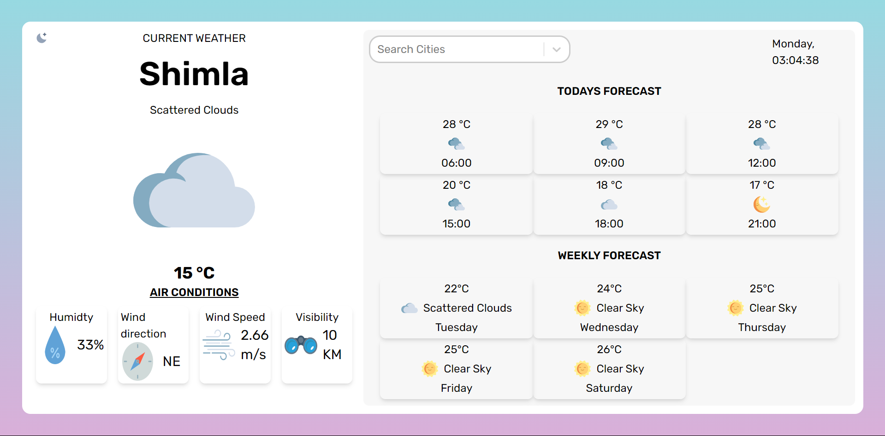
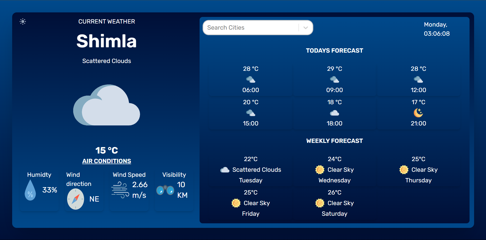

# Weather App

Check the current weather on any city on the planet.

The app is developed using React.js and TailwindCSS

 

## 💻 Live Demo:

https://weatherapp0505.vercel.app/

 

## Features

1. User's ability to search cities

2. Current local time and date

3. Temperatures and humidity

4. Wind speed and direction

## ✨ Getting Started

- Make sure you already have `Node.js` and `npm` installed in your system.
- You need an API key from [OpenWeatherMap](https://openweathermap.org/). After creating an account, [grab your key](https://home.openweathermap.org/api_keys).
- Then, under the `src` directory, go to `api/OpenWeatherService` and replace `WEATHER_API_KEY` with your OpenWeatherMap API Key.
  - **`api/OpenWeatherService.js`**: It contains the code related to the back-end of the application.

 

## Installation

1. `git clone https://github.com/Ritikchauhan1704/WeatherApp.git`

2. `cd WeatherApp`

3. `npm install`

4. Log-in to [Openweathermap.com](https://openweathermap.org/)

5. Create an API key

6. Create .env

7. Paste API key for `OPENWEATHER_API_KEY` with name `VITE_API_KEY`

8. `npm run dev`
